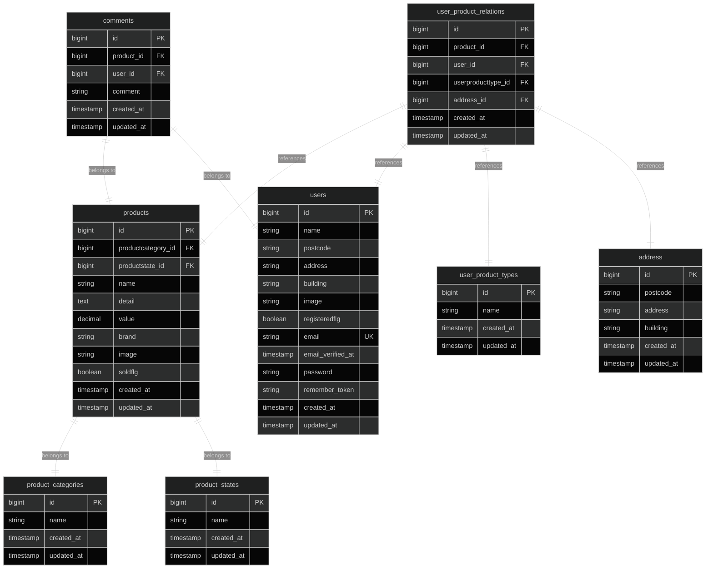

# フリマアプリ

## 概要

Laravel 8.x を使用したフリマアプリケーションです。ユーザーが商品を出品・購入でき、コメント機能やマイリスト機能を備えた総合的なマーケットプレイスです。

## 使用技術(実行環境)

### バックエンド

-   **PHP**: 8.1
-   **Laravel**: 8.75

### フロントエンド

-   **HTML/CSS**: レスポンシブデザイン対応
-   **JavaScript**: フォーム操作・バリデーション・モーダル表示・ページネーション・削除確認

### データベース

-   **MySQL**: 8.0.26

### インフラ・ツール

-   **Docker**: コンテナ化環境
-   **Nginx**: 1.21.1 (Web サーバー)
-   **PHPMyAdmin**: データベース管理ツール

## 環境構築

### 前提条件

-   Docker
-   Docker Compose

### 1. リポジトリのクローン

```bash
git clone [リポジトリURL]
cd FleaMarketApp
```

### 2. Docker コンテナのビルド・起動

```bash
# コンテナのビルドと起動
docker compose up -d --build
```

### 3. 依存関係のインストール

```bash
# PHPコンテナに入る
docker compose exec php bash

# Composerで依存関係をインストール
composer install
```

### 4. 環境設定ファイルの作成

```bash
# .envファイルをコピー
cp .env.example .env

# アプリケーションキーの生成
php artisan key:generate
```

### 5. データベースの設定

`.env`ファイルでデータベース接続情報を設定：

```env
DB_CONNECTION=mysql
DB_HOST=mysql
DB_PORT=3306
DB_DATABASE=laravel_db
DB_USERNAME=laravel_user
DB_PASSWORD=laravel_pass
```

### 6. データベースマイグレーション

```bash
# マイグレーションの実行
php artisan migrate

# シーダーの実行（サンプルデータの投入）
php artisan db:seed

# マイグレーションの状態確認
php artisan migrate:status

# マイグレーションのロールバック（必要に応じて）
php artisan migrate:rollback

# 全マイグレーションのリセット（開発環境のみ）
php artisan migrate:fresh --seed
```

### 7. ストレージディレクトリの権限設定

```bash
# ストレージディレクトリの権限を設定
chmod -R 777 storage
chmod -R 777 bootstrap/cache
```

## ER 図



### フィールド詳細

#### users テーブル

-   ユーザー情報を管理
-   住所情報（postcode, address, building）を含む
-   プロフィール画像（image）を保存
-   登録フラグ（registeredflg）でユーザー状態を管理
-   メールアドレス（email）でユニーク制約

#### products テーブル

-   商品情報を管理
-   カテゴリ、状態との関連付け
-   ブランド情報は文字列フィールド（brand）で管理
-   売却フラグ（soldflg）で商品の販売状況を管理

#### product_categories テーブル

-   商品カテゴリを管理
-   例：「Electronics」「Clothing」「Books」「Home & Garden」「Sports」など

#### product_states テーブル

-   商品の状態を管理
-   例：「新品・未使用」「未使用に近い」「目立った傷や汚れなし」など

#### user_product_relations テーブル

-   ユーザーと商品の関係を管理
-   マイリスト、購入履歴、お気に入りなどの種別を管理
-   配送先住所との関連付け

#### user_product_types テーブル

-   ユーザーと商品の関係の種別を管理
-   例：「mylist」「purchase」など

#### address テーブル

-   配送先住所を管理
-   複数の配送先を管理可能

#### comments テーブル

-   商品へのコメントを管理
-   商品（products）とユーザー（users）に直接関連
-   userproductrelation_id は削除され、直接的な関連に変更

### 主な変更点

1. **productbrands テーブルを削除**

    - ブランド情報は products テーブルの brand カラムで管理

2. **comments テーブルの構造変更**

    - userproductrelation_id を削除
    - product_id と user_id を直接参照するように変更

3. **テーブル名の統一**

    - スネークケース（snake_case）に統一
    - Laravel の命名規則に準拠

## URL

-   **メインサイト**: http://localhost/
-   **商品一覧**: http://localhost/productlist
-   **商品詳細**: http://localhost/productlist/product/{id}
-   **マイページ**: http://localhost/mypage
-   **購入手続き**: http://localhost/purchase/{id}
-   **認証ページ**: http://localhost/auth/login
-   **PHPMyAdmin**: http://localhost:8080
-   **MailHog**: http://localhost:8025

## メール設定

```env
MAIL_MAILER=smtp
MAIL_HOST=mailhog
MAIL_PORT=1025
MAIL_ENCRYPTION=null
MAIL_USERNAME=
MAIL_PASSWORD=
MAIL_FROM_ADDRESS=noreply@example.com
MAIL_FROM_NAME=FleaMarketApp
APP_URL=http://localhost
```

### 認証手順（メール確認）

1. ユーザー登録
2. /email/verify に遷移
3. MailHog で届いた「Verify Email」メールのリンクを開く
4. 認証完了

## よく使うコマンド

```bash
# 起動/停止/再起動
docker compose up -d
docker compose down
docker compose restart

# 状態/ログ
docker compose ps
docker compose logs -f nginx
docker compose logs -f php

# アプリ最適化
docker compose exec php php artisan optimize:clear
docker compose exec php php artisan optimize
```
