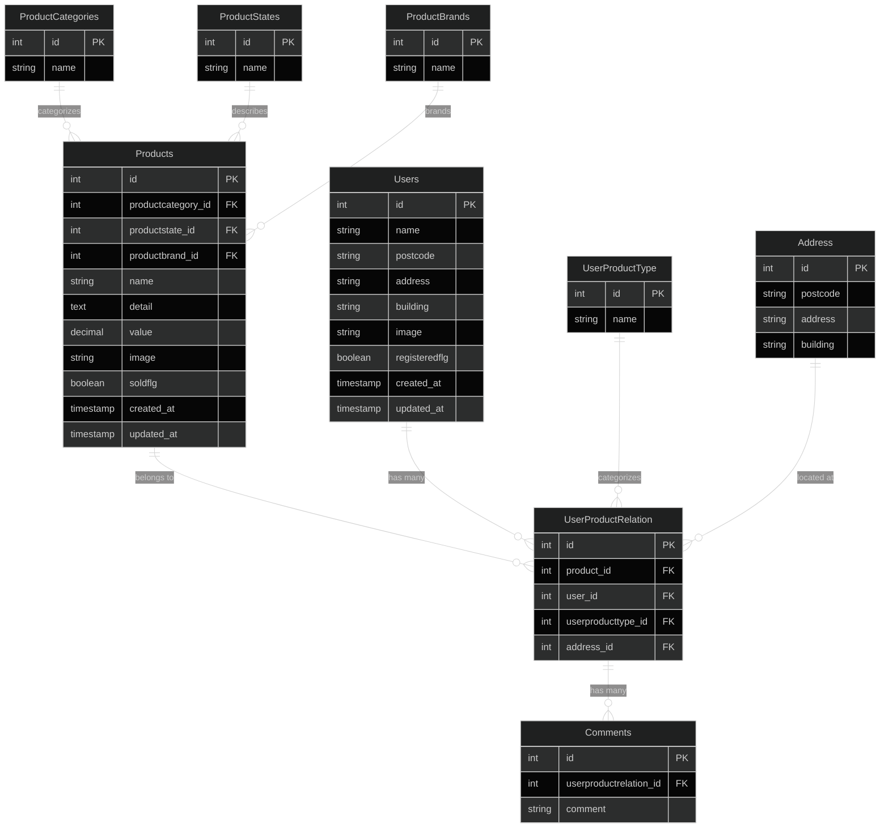

# フリマアプリ

## 概要

Laravel 8.x を使用したフリマアプリケーションです。ユーザーが商品を出品・購入でき、コメント機能やマイリスト機能を備えた総合的なマーケットプレイスです。

## 使用技術(実行環境)

### バックエンド

-   **PHP**: 8.1
-   **Laravel**: 8.75

### フロントエンド

-   **HTML/CSS**: レスポンシブデザイン対応
-   **JavaScript**: フォーム操作・バリデーション・モーダル表示・ページネーション・削除確認

### データベース

-   **MySQL**: 8.0.26

### インフラ・ツール

-   **Docker**: コンテナ化環境
-   **Nginx**: 1.21.1 (Web サーバー)
-   **PHPMyAdmin**: データベース管理ツール

## 環境構築

### 前提条件

-   Docker
-   Docker Compose

### 1. リポジトリのクローン

```bash
git clone [リポジトリURL]
cd FleaMarketApp
```

### 2. Docker コンテナのビルド・起動

```bash
# コンテナのビルドと起動
docker-compose up -d --build
```

### 3. 依存関係のインストール

```bash
# PHPコンテナに入る
docker-compose exec php bash

# Composerで依存関係をインストール
composer install
```

### 4. 環境設定ファイルの作成

```bash
# .envファイルをコピー
cp .env.example .env

# アプリケーションキーの生成
php artisan key:generate
```

### 5. データベースの設定

`.env`ファイルでデータベース接続情報を設定：

```env
DB_CONNECTION=mysql
DB_HOST=mysql
DB_PORT=3306
DB_DATABASE=laravel_db
DB_USERNAME=laravel_user
DB_PASSWORD=laravel_pass
```

### 6. データベースマイグレーション

```bash
# マイグレーションの実行
php artisan migrate

# シーダーの実行（サンプルデータの投入）
php artisan db:seed

# マイグレーションの状態確認
php artisan migrate:status

# マイグレーションのロールバック（必要に応じて）
php artisan migrate:rollback

# 全マイグレーションのリセット（開発環境のみ）
php artisan migrate:fresh --seed
```

### 7. ストレージディレクトリの権限設定

```bash
# ストレージディレクトリの権限を設定
chmod -R 777 storage
chmod -R 777 bootstrap/cache
```

## ER 図



### フィールド詳細

#### Users テーブル

-   ユーザー情報を管理
-   住所情報（postcode, address, building）を含む
-   プロフィール画像（image）を保存
-   登録フラグ（registeredflg）でユーザー状態を管理

#### Products テーブル

-   商品情報を管理
-   カテゴリ、状態、ブランドとの関連付け
-   売却フラグ（soldflg）で商品の販売状況を管理

#### ProductCategories テーブル

-   商品カテゴリを管理
-   例：「服・ファッション」「家電・スマホ・カメラ」など

#### ProductStates テーブル

-   商品の状態を管理
-   例：「新品・未使用」「未使用に近い」「目立った傷や汚れなし」など

#### ProductBrands テーブル

-   商品ブランドを管理
-   例：「NIKE」「Apple」「UNIQLO」など

#### UserProductRelation テーブル

-   ユーザーと商品の関係を管理
-   マイリスト、購入履歴、お気に入りなどの種別を管理
-   配送先住所との関連付け

#### UserProductType テーブル

-   ユーザーと商品の関係の種別を管理
-   例：「マイリスト」「購入履歴」「お気に入り」など

#### Address テーブル

-   配送先住所を管理
-   複数の配送先を管理可能

#### Comments テーブル

-   商品へのコメントを管理
-   UserProductRelation との関連付けで、特定の購入・マイリストに関連するコメントを管理

## URL

### 開発環境

-   **メインサイト**: http://localhost/
-   **商品一覧**: http://localhost/productlist
-   **商品詳細**: http://localhost/productlist/product/{id}
-   **マイページ**: http://localhost/mypage
-   **購入手続き**: http://localhost/purchase/{id}
-   **認証ページ**: http://localhost/auth/login
-   **PHPMyAdmin**: http://localhost:8080

### データベース接続情報

-   **ホスト**: localhost
-   **ポート**: 3306
-   **データベース名**: laravel_db
-   **ユーザー名**: laravel_user
-   **パスワード**: laravel_pass

## 主な機能

### 商品管理

-   商品一覧表示（おすすめ商品、マイリスト）
-   商品検索機能（商品名での検索）
-   商品詳細表示（画像、価格、説明、状態等）
-   商品の売却状況管理（soldflg）

### ユーザー機能

-   ユーザー登録・ログイン・ログアウト
-   マイページ（プロフィール管理）
-   住所情報の管理
-   プロフィール画像の設定

### 購入機能

-   購入手続き（支払い方法選択、配送先確認）
-   住所変更機能
-   購入完了画面
-   支払い方法のバリデーション

### マイリスト機能

-   商品をお気に入りに追加・削除
-   マイリスト一覧表示

### コメント機能

-   商品へのコメント投稿
-   コメント一覧表示（3 件まで表示、それ以降は「さらに表示」）
-   リアルタイムコメント追加
-   ログインユーザーのみコメント可能

### 認証機能

-   ユーザー登録
-   ログイン・ログアウト
-   パスワードリセット

## ディレクトリ構造

```
FleaMarketApp/
├── docker/                 # Docker設定ファイル
│   ├── mysql/             # MySQL設定
│   ├── nginx/             # Nginx設定
│   └── php/               # PHP設定
├── src/                   # Laravelアプリケーション
│   ├── app/               # アプリケーションロジック
│   │   ├── Http/Controllers/  # コントローラー
│   │   └── Models/            # モデル
│   ├── database/          # データベース関連
│   │   ├── migrations/    # マイグレーション
│   │   └── seeders/       # シーダー
│   ├── public/            # 公開ファイル
│   │   ├── css/           # CSSファイル
│   │   └── images/        # 画像ファイル
│   ├── resources/         # ビュー・アセット
│   │   └── views/         # Bladeテンプレート
│   └── routes/            # ルート定義
├── docker-compose.yml     # Docker Compose設定
└── README.md             # このファイル
```
